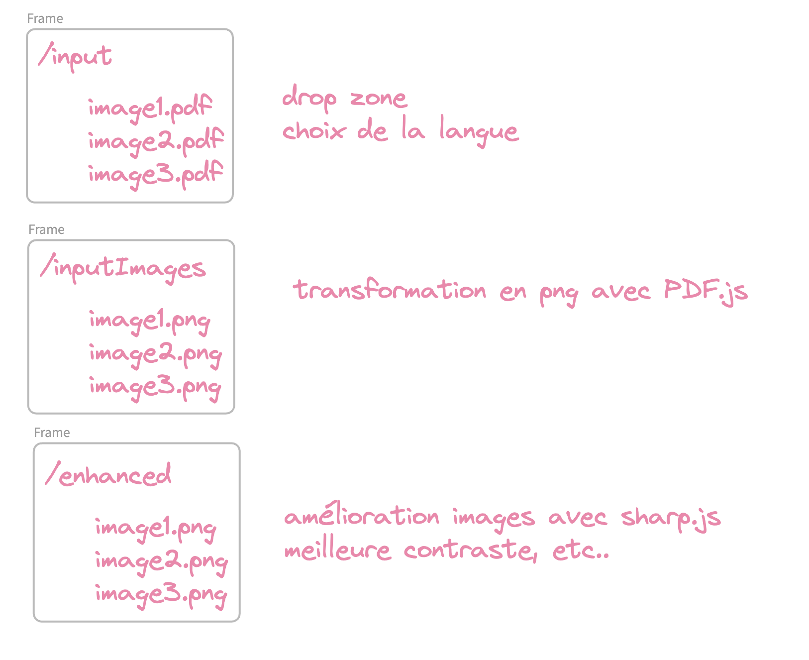
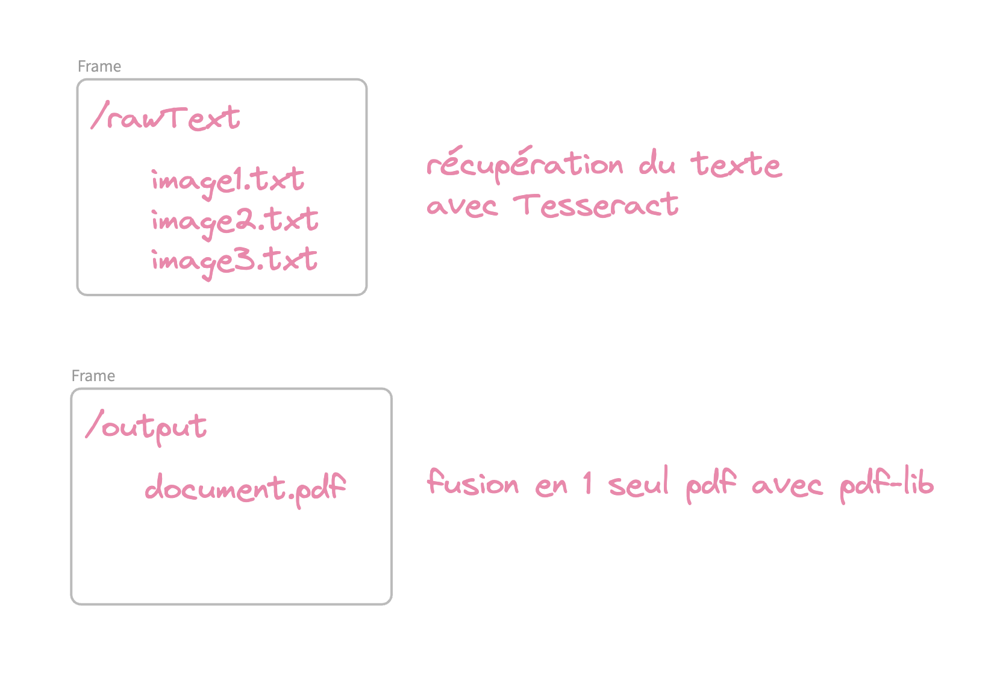

# TODO

- déposer les fichiers pdf dans un répertoire input avec une drop zone
- choisir la langue
- transformation des pdf en png avec PDF.JS (ou pdf2pic) (avant pdftopng)
- amélioration des images avec sharp (avant imageMagick)
- récupération du texte des documents avec tesseract.js
- merge des pdf en 1 seul pdf avec pdf-lib (avant pdftk)
(- génération du pdf en mode colonne ou sans espace)

* pdf2json indique qu'il utilise pdf.js under the hood, qui est censé fonctionner dans un environnement browser.
Pour le faire fonctionner en Node/Deno, il faut s'assurer d'avoir des libs qui gèrent :
- XHR Level 2 (for Ajax)
- DOMParser (for parsing embedded XML from PDF)
- Web Worker (to enable parsing work run in a separated thread)
- Canvas (to draw lines, fills, colors, shapes in browser)
- Others (like web fonts, canvas image, DOM manipulations, etc.)

## UI

- création d'une homepage en DSFR
- création d'une page avec une drop zone pour lancer le traitement, permettant de déposer plusieurs fichiers à la fois
- renvoi d'un fichier pdf avec texte sélectionnable ou de texte (au choix)

Référence :

- https://spote.developpement-durable.gouv.fr/offre/webocr -> voir si possible de récupérer leur code
- <https://huggingface.co/spaces/pragnakalp/OCR-image-to-text> -> des outils IA en plus mais paraît dur à héberger
- <https://vert.sh/> -> exemple de drop zone
- https://blog.logrocket.com/parsing-pdfs-node-js/
- https://lirantal.com/blog/how-to-read-and-parse-pdfs-pdfjs-create-pdfs-pdf-lib-nodejs
- https://medium.com/deno-the-complete-reference/5-useful-npm-packages-for-pdf-processing-in-node-js-c573cee51804 (semble à côté de la plaque ou généré par une IA...)
- https://github.com/racosa/pdf2text-ocr?tab=readme-ov-file : un exemple de démo qui utilise Tesseract
    - chaque page est converti en image avec PDF.js
    - chaque image est converti en texte en utilisant Tesseract.js
    - super car rien n'est stocké sur les serveurs et tout est calculé côté client. Donc pas d'inquiétude sur l'éventuel charge du serveur
    - super aussi car on voit qu'on pourrait le faire en React SPA
    - super car juste 2 dépendances. Wow!!
    - le passer en React, ajouter une drop zone, le fait d'en faire 10 max en parallèle, faire une progress bar => déjà quelque chose d'intéressant, en plus souverain sur nos serveurs DGFiP
- https://scribeocr.com/#
- https://golb.hplar.ch/2019/07/ocr-with-tesseractjs.html -> à lire